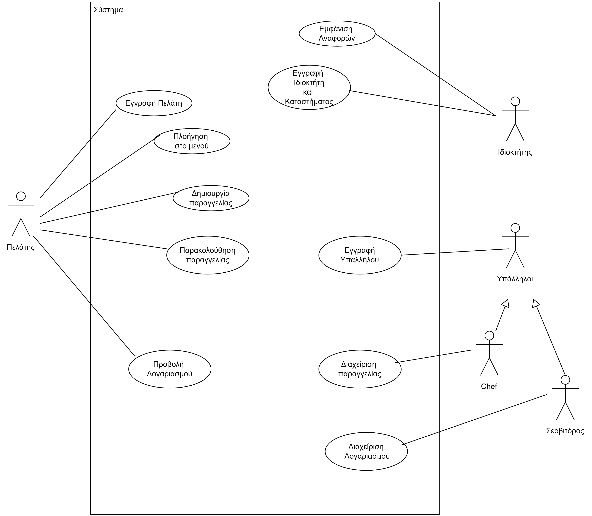
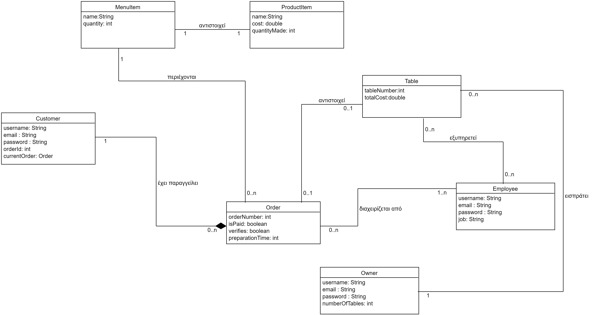

# Team 23

# Εισαγωγή

Το παρόν έγγραφο αναφέρεται σε ένα 
Σύστημα Παραγγελιών επιχειρήσεων εστίασης. Στη συνέχεια παρατίθεται μία συνοπτική περιγραφή των απαιτήσεων του πεδίου προβλήματος. Τέλος περιγράφεται και το διαγράμμα των περιπτώσεων χρήσης.

Η εύρεσης των απαιτήσεων αποτελεί το πρώτο βήμα στην υλοποιήση του λογισμικού. Συμπληρωματικά, το διάγραμμα χρήσης περιγράφει την λειτουργικότητα του συστήματος.

## Εμβέλεια

\[*Περιγράφουμε τι θα κάνει και κυρίως τι δεν θα κάνει το λογισμικό. Βλέπε παράδειγμα 3-2 του βιβλίου στη σελίδα 139.*

*Ένα διάγραμμα περιβάλλοντος (πρωταρχικό διάγραμμα ροής δεδομένων) που βοηθά στην κατανόηση του συστήματος σε σχέση με το περιβάλλον του. Βλέπε το σχήμα 4-12 του παραδείγματος 4-1 στη σελίδα 185 του βιβλίου*\]

&nbsp;
## Ορισμοί ακρώνυμα και συντομογραφίες

|  Ακρώνυμα  |   Ανάλυση Ακρωνύμων     |
| ---------- |-------------------------|
|**QR Code**| Σημαίνει Quick Response και χρησιμοποιείται σαν link.|
|**Τραπέζι**|  Πάνω στο τραπέζι θα είναι το QR Code(βλέπε πάνω γραμμή) εκτυπωμένο και έτοιμο για σκανάρισμα από τους πελάτες.|
|**Μενού :**| Το μενόυ αποτελείται από όλα τα φαγητά, ποτά και λοιπές υπηρεσίες που προσφέρει το μαγαζί|
|**Παραγγελία**| Ο πελάτης επιλέγει τα είδη που θα ήθελε να παραλάβει|
|**Λογαριασμός**| Αθροιστικό χρηματικό σύνολο των υπηρεσιών που έχουν επιλεγεί στην παραγγελία του πελάτη|
|**Έκπτωση**| Αφαιρούμε από τον λογαριασμό το ποσό της έκπτωσης|
|**Πελάτης**| Ο άνθρωπος που θα αγοράσει τις υπηρεσίες|
|**Εγγεγραμμένος Πελάτης**| Ο άνθρωπος που έχει εγγραφεί στην εφαρμογή και θα αγοράσει τις υπηρεσίες, με δυνατότητα έκπτωσης|
|**Ιδιοκτήτης**| Ο άνθρωπος που του ανήκει η επιχείρηση|
|**Σεφ**|Αυτός που μαφειρεύει ή φτιάχνει τα κοκταιλ ή πλένει τα πιάτα|
|**Σερβιτόρος**|Αυτός που σερβίρει τα φαγητά και τις άλλες υπηρεσίες|
|**Αναφορές**|Στατιστικά στοιχεία που αφορούν την επιχείρηση|

&nbsp;

# Συνολική περιγραφή

## Επισκόπηση μοντέλου περιπτώσεων χρήσης

# Διάγραμμα Περιπτώσεων Χρήσης

&nbsp;
# Περιπτώσεις χρήσης 

|  Περιπτώσεις χρήσης  |   Ανάλυση Περιπτώσεων Χρήσης     |
| -------------------- |----------------------------------|
|**ΠΧ Εγγραφή Ιδιοκτήτη**| Ο ιδιοκτήτης εγγράφει το κατάστημα στην εφαρμογή χρησιμοποιώντας τα στοιχέια του εστιατορίου, το μενού και τα διαθέσιμα τραπέζια. |
|**ΠΧ Εγγραφή πελατών**| Οι πελάτες θα μπορούν να εγγράφονται στην εφαρμογή.|
|**ΠΧ Εγγραφή υπαλλήλων**| Οι υπάλληλοι εγγράφονται χρησιμοποιώντας το email τους με σκοπό να προστεθούν από τον ιδιοκτήτη.|
|**ΠΧ Πλοήγηση στο Μενού**|Οι πελάτες θα μπορούν να δουν το μενού το εστιατορίου.|
|**ΠΧ Διαχείριση υπαλλήλων**| Ο ιδιοκτήτης θα μπορεί να δίνει δικαιώματα στους υπαλλήλους και να ελέγχει την δραστηριότητά τους.|
|**ΠΧ Δημιουργία Παραγγελίας**| Οι πελάτες θα μπορούν να υποβάλλουν την παραγγελίας τους μέσω της εφαρμογής.|

|**ΠΧ Παρακολούθηση παραγγελίας από τον πελάτη**| Ο πελάτης θα μπορεί να παρακολουθεί σε ποιο στάδιο της προετοιμασίας βρίσκεται η παραγγελία του μέσω της εφαρμογής.|
|**ΠΧ Εμφάνιση αναφορών**| Το σύστημα θα εμφανίζει αναφορές στον ιδιοκτήτη για την πορεία της επιχείρησής του.|
|**ΠΧ Προβολή Λογαριασμού**| Ο πελάτης θα μπορεί να δει τον λογαριασμό για να πληρώσει.|
|**ΠΧ Διαχείριση Λογαριασμού**| Ο υπάλληλος θα μπορεί να επεξεργαστεί τον λογαριασμό των πελατών.|
&nbsp;

# Ειδικές Απαιτήσεις 

## Απαιτήσεις συστήματος

1. Εγγραφή ιδιοκτήτη, υπαλλήλων και πελατών στην υπηρεσία
2. Δημιουργία και αλληλεπίδραση με  QR code
3. Διαχείριση προσωπικού
4. Πλοήγηση στο μενού
5. Υποβολή παραγγελίας
6. Παρακολούθηση της κατάστασης της παραγγελίας
7. Διαχείριση παραγγελίας από τον σεφ 
8. Εμφάνιση αναφορών καταστήματος
9. Επιβεβαίωση πληρωμής από τον σερβιτόρο

## Περιπτώσεις χρήσης

### Οι ενδιαφερόμενοι και οι ανάγκες τους

\[*Ένας πίνακας των ενδιαφερομένων (stakeholders) με τις ανάγκες τους. Βλέπε πίνακα 3-6 του παραδείγματος 3-2 στη σελίδα 138 του βιβλίου.*\]

### Actors του συστήματος

|  Actors     |       
| -------------------- 
|**Ιδιοκτήτης**| 
|**Πελάτης**|
|**Υπάλληλοι**|
|**Σεφ**|

### Περιγραφές περιπτώσεων χρήσης

\[*Γράφονται οι περιπτώσεις χρήσης οι οποίες συνοδεύονται με διαγράμματα δραστηριότητας εάν θεωρηθεί αναγκαίο.*

*Βλέπε , το παράδειγμα 3-7 στη σελίδα 159, το παράδειγμα 3-8 στη σελίδα 160 και το παράδειγμα 3-9 στη σελίδα 162.*\]

#### [ΠΧ1 Εγγραφή Ιδιοκτήτη και Καταστήματος](uc1-OwnerRegister.md)

#### [ΠΧ2 Εγγραφή Πελάτη](uc2-CustomerRegister.md)

#### [ΠΧ3 Δημιουργία Παραγγελίας](uc3-CreateOrder.md)

#### [ΠΧ4 Διαχείριση Παραγγελιών από τον Σεφ.](uc4-ManagingOrdersbytheChef.md)

&nbsp;
# Συμπληρωματικές προδιαγραφές

## Περιγραφή Μη Λειτουργικών Απαιτήσεων

1. Εύχρηστο UI : Ο στόχος είναι ο πελάτης να έχει την βέλτιστη δυνατή εμπειρία χρήσης. 
2. Ασφάλεια των προσωπικών στοιχείων του χρήστη. Τα στοιχεία που θα λάβει η εταιρία από τους χρήστες της εφαρμογής δεν θα πρέπει να τα εκμεταλλεύεται.

&nbsp;
&nbsp;

# Υποστηρικτικό υλικό

## Μοντέλο πεδίου

