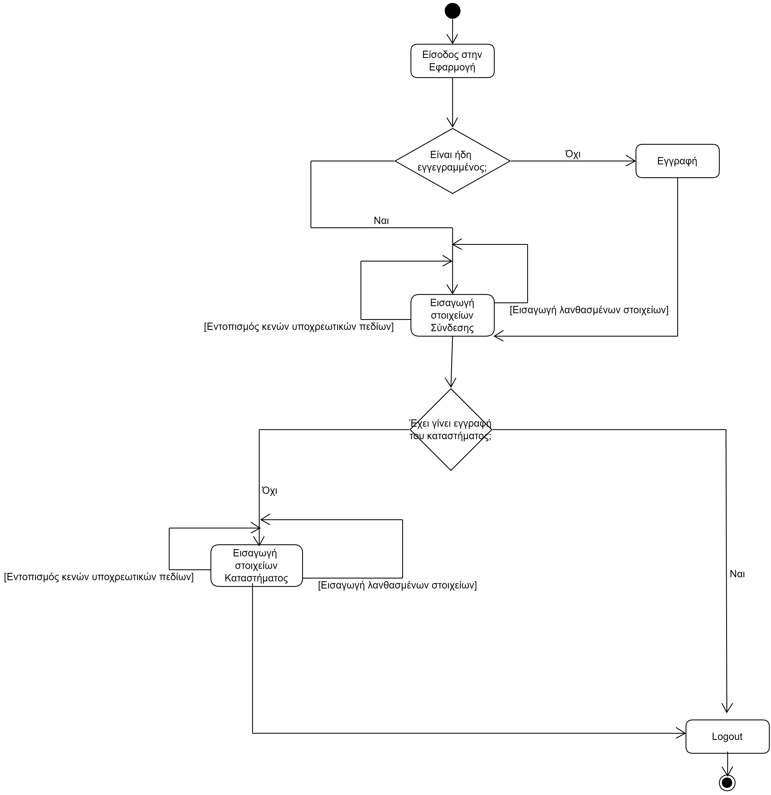

# ΠΧ1. Εγγραφή Ιδιοκτήτη και καταστήματος

**Πρωτεύων Actor**: Ιδιοκτήτης  

**Ενδιαφερόμενοι**

**Ιδιοκτήτης**: Εγγράφει στο σύστημα το κατάστημα εισάγοντας τα στοιχεία του καταστήματος,τον αριθμό τραπεζιών καθώς και το μενού. 

**Πελάτης**: Θέλει να μπορεί να πραγματοποιεί συναλλαγές από οποιοδήποτε τραπεζικό υποκατάστημα.  

## Βασική Ροή

###  Εισαγωγή στοιχείων ιδιοκτήτη

1. Ο ιδιοκτήτης εισάγει τα στοιχεία του στην εφαρμογή.
2. Ο ιδιοκτήτης εισάγει το μενού του καταστήματος.
3. Ο ιδιοκτήτης εισάγει τον αριθμό των διαθέσιμων τραπεζιών.

**Εναλλακτικές Ροές**

*1α. Εισαγωγή Λανθασμένων Στοιχείων.*  
1. Το σύστημα εμφανίζει μήνυμα σφάλματος και η περίπτωση χρήσης τερματίζει.

*1α. Δεν έχει γίνει εισαγωγή κάποιου από τα υποχρεωτικά στοιχεία*
1. Το σύστημα εμφανίζει κατάλληλο μήνυμα σφάλματος
2. Η ΠΧ επιστρέφει στο βήμα 1 της βασικής ροής

&nbsp;
# Διαγράμματα
&nbsp;

## Activity Diagram
&nbsp;

## Sequence Diagram 
&nbsp;
