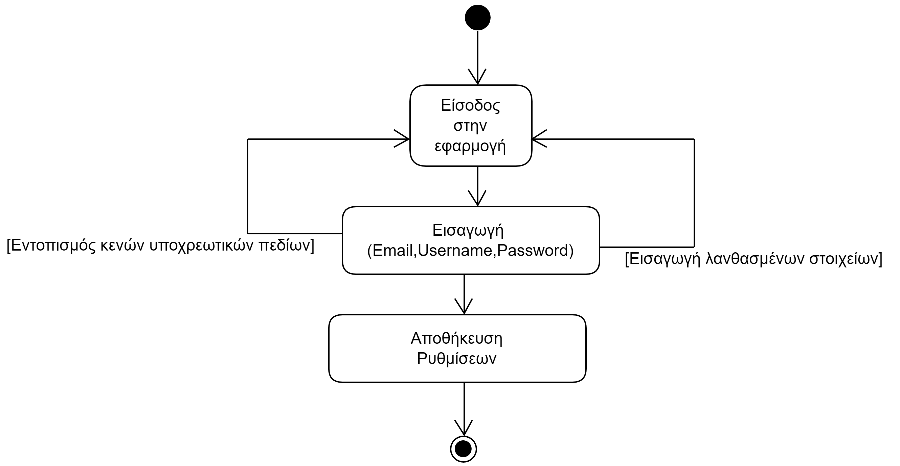
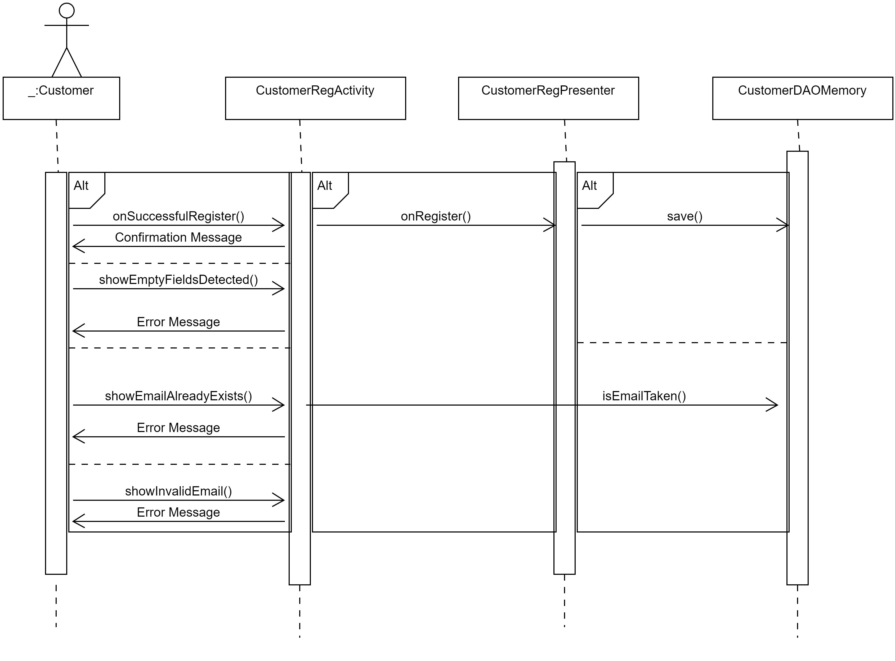

# ΠΧ2. Εγγραφή Πελάτη

**Πρωτεύων Actor**: Πελάτης

**Ενδιαφερόμενοι** 

**Πελάτης**: Θέλει να κάνει εγγραφή στην εφαρμογή  

## Βασική Ροή

###  Εισαγωγή στοιχείων πελάτη
1.  Ο πελάτης εισάγει τα στοιχεία του στην εφαρμογή.

## Εναλλακτικές Ροές

*1α. Δεν έχει γίνει εισαγωγή κάποιου από τα υποχρεωτικά στοιχεία*

    1. Το σύστημα εμφανίζει κατάλληλο μήνυμα σφάλματος
    2. Η ΠΧ επιστρέφει στο βήμα 1 της βασικής ροής
    

## Διαγράμματα
&nbsp;

### Activity Diagram

### Sequence Diagram

