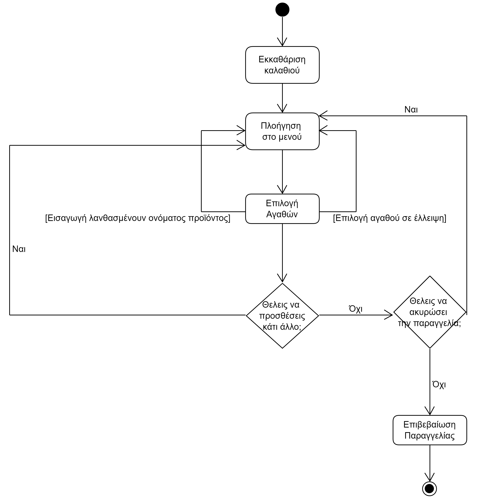
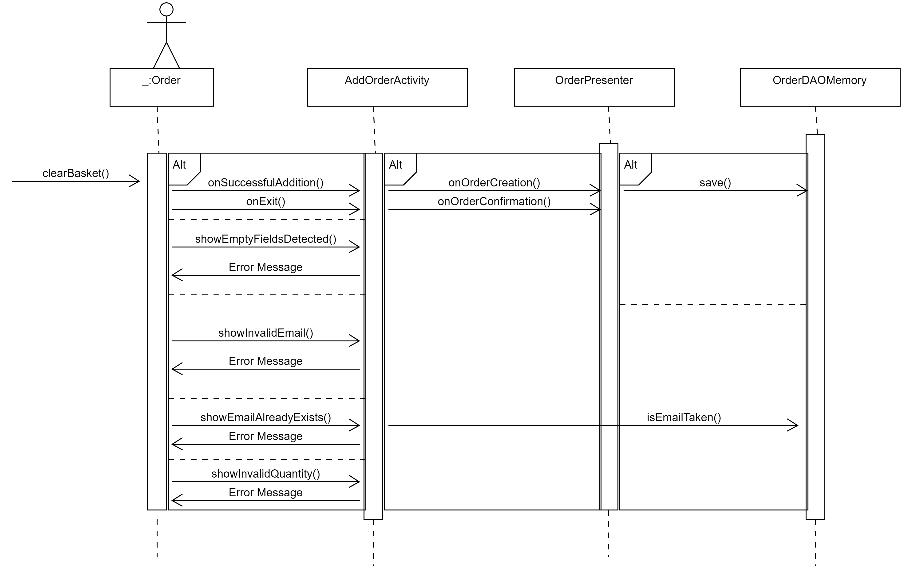

# ΠΧ3. Δημιουργία Παραγγελίας

**Πρωτεύων Actor**: Πελάτης  

**Ενδιαφερόμενοι** 

**Πελάτης**: Θέλει να δημιουργήσει μία παραγγελία.  

## Βασική Ροή

### Δημιουργία Παραγγελίας
1. Δημιουργείται ένα άδειο μενού.
2. Ο πελάτης κάνει πλοήγηση στο μενού.
3. Προσθέτει τα προϊόντα που επιθυμεί.
4. Επιβεβαιώνει την παραγγελία του.

## Εναλλακτικές Ροές

*3α. Επιλογή προιόντος που είναι σε έλλειψη.*
1. Εμφανίζεται μήνυμα λάθους.
2. Η περίπτωση χρήσης επιστρέφει στο βήμα 1.

  
*4α. Ακύρωση παραγγελίας*
1. Η περίπτωση χρήσης επιστρέφει στο βήμα 1.

## Διαγράμματα
&nbsp;

### Activity Diagram

### Sequence Diagram

